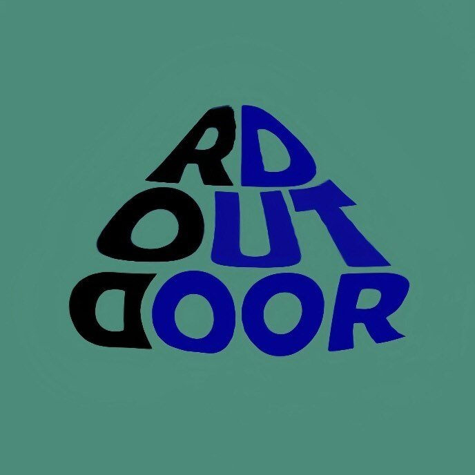

<p align="center">
  
</p>

<h1 align="center">RDOUTDOOR</h1>
<p align="center"><b>Aplikasi Rental Hiking & Outdoor Modern</b></p>
<p align="center">
  
  
  
  
</p>

---

RDOUTDOOR adalah aplikasi web rental/sewa alat hiking, camping, dan outdoor berbasis Laravel. Dirancang dengan UI/UX modern, branding outdoor konsisten, animasi transisi, serta aksesibilitas yang baik.

---

## 🚀 Fitur Utama
- 🌄 Landing page modern, animasi, branding outdoor
- 🔐 Autentikasi: Login, Register, Lupa Password (reset via email)
- 🏕️ About Us & Contact Us interaktif, statistik, animasi
- 🛒 Dashboard Admin: kelola produk, order, user (dashboard user/penyewa coming soon)
- ⏳ Loader custom, pesan error ramah, aksesibilitas (aria-label, aria-live, autofokus)
- 📱 Responsive & mobile friendly

## 📦 Struktur Folder Penting
- `resources/views/` : Blade template (landing, auth, about, contact, admin, dsb)
- `app/Models/` : Model Laravel (User, Product, Order, dsb)
- `app/Http/Controllers/` : Controller utama
- `database/migrations/` : Migrasi database
- `public/images/` : Logo, ilustrasi, dsb

## ⚡ Instalasi & Setup
1. **Clone repository & install dependencies**
   ```powershell
   git clone <repo-url>
   cd rdoutdoor
   composer install
   npm install && npm run build
   ```
2. **Copy file environment & generate key**
   ```powershell
   copy .env.example .env
   php artisan key:generate
   ```
3. **Konfigurasi database**
   - Edit `.env` dan sesuaikan DB_DATABASE, DB_USERNAME, DB_PASSWORD
   - Jalankan migrasi:
     ```powershell
     php artisan migrate
     ```
4. **Konfigurasi email (untuk reset password)**
   - Edit `.env` bagian MAIL_*
   - Contoh SMTP Gmail:
     ```env
     MAIL_MAILER=smtp
     MAIL_HOST=smtp.gmail.com
     MAIL_PORT=587
     MAIL_USERNAME=your_email@gmail.com
     MAIL_PASSWORD=your_app_password
     MAIL_ENCRYPTION=tls
     MAIL_FROM_ADDRESS=your_email@gmail.com
     MAIL_FROM_NAME="RDOUTDOOR"
     ```
5. **Jalankan aplikasi**
   ```powershell
   php artisan serve
   ```
   Akses di http://localhost:8000

## 📝 Catatan Pengembangan
- Dashboard user/penyewa akan dikembangkan selanjutnya
- Fitur email reset password sudah siap, pastikan konfigurasi SMTP benar
- UI/UX, animasi, dan branding outdoor konsisten di seluruh halaman

## 🤝 Kontribusi
Pull request & issue sangat diterima untuk pengembangan lebih lanjut!

---

<p align="center">
  <b>© 2025 RDOUTDOOR. All rights reserved.</b>
</p>
